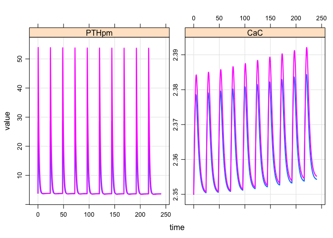

Calcium Bone Model
==================

-   Documentation [here](vignettes/modeldoc.Rmd)

``` r
library(cabone)
```

Simulate teriparatide data
--------------------------

``` r
out <- sim_teri(dose=c(20,40), dur=9)

plot(out)
```



Simulate denosumab data
-----------------------

``` r
out <- sim_denos(dose=c(10,60,210), dur=6)

plot(out, log(DENCP) + BMDlsDENchange~time)
```


Simulate secondary hyperparathyroidism
======================================

``` r
sim_2h() %>% plot
```


Some helper functions
=====================

Convert `teriparatide` doses
----------------------------

``` r
amt_teri(20)
```

    . [1] 4856.962

Export the model code
---------------------

``` r
file <- file.path(tempdir(),"my_model.cpp")
file_location <- cabone_export(file)
```
