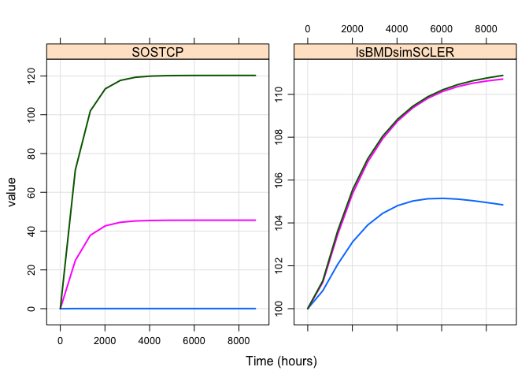
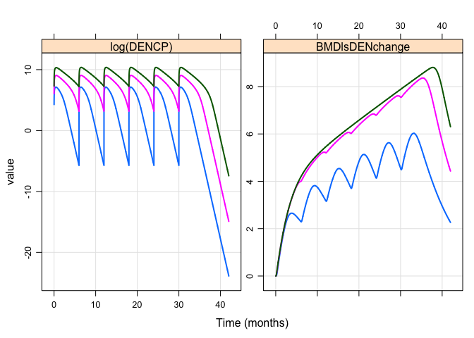

About
=====

A multiscale systems model of bone health and mineral homeostasis. Please see the [wiki page](https://github.com/metrumresearchgroup/OpenBoneMin/wiki) for more information on this project.

Community contributions to this project are included [here](inst/community).

Documentation
=============

-   Documentation [here](vignettes/modeldoc.Rmd)

Installation
============

Installation of `OpenBoneMin` requires the `devtools` package

``` r
if(!require("devtools")) install.packages("devtools")
```

Use the `install_github` function inside `devtools` to install the `OpenBoneMin` package from GitHub to your local machine

``` r
devtools::install_github("metrumresearchgroup/OpenBoneMin")
```

You can test the installation by trying an example

``` r
example("sim_teri", package = "OpenBoneMin")
```

Usage
=====

-   [Simulate teriparatide data](#teri)
-   [Simulate denosumab data](#denos)

``` r
library(OpenBoneMin)
library(ggplot2)
```

<a name="teri"></a>

Simulate teriparatide data
--------------------------

-   `PTHpm` teriparatide concentration (pM)
-   `CaC` calcium concentration (mM)

``` r
out <- sim_teri(dose=c(20,40), dur=9)

plot(out)
```



<a name="denos"></a>

### Simulate denosumab data

-   `DENCP` denosumab concentration
-   `BMDlsDENchange` lumbar spine change from basline

``` r
out <- sim_denos(dose=c(10,60,210), dur=6)

plot(out, log(DENCP) + BMDlsDENchange ~ time, xlab="Time (months)")
```



Some helper functions
=====================

Convert `teriparatide` doses
----------------------------

Usually, we think of doses in micrograms. This function turns those doses into `pmol`.

``` r
amt_teri(20)
```

    . [1] 4856.962

Export the model code
---------------------

It's a little hard to see what's happening here. But basically, this grabs the model code and writes it to a file of your choosing. Use this when you want to export the model and start making changes yourself.

``` r
file <- file.path(tempdir(),"my_model.cpp")
file_location <- BoneMin_export(file)
```
