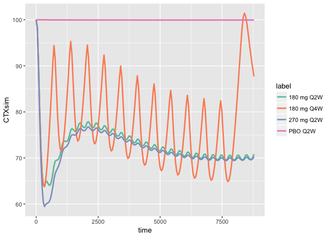
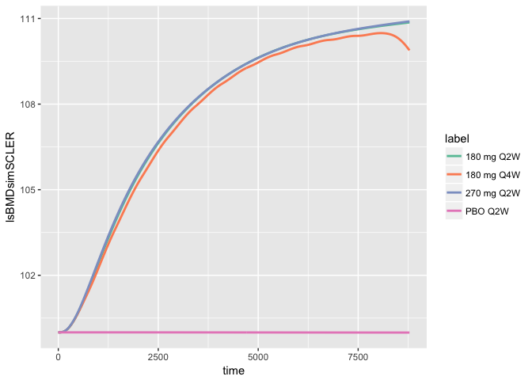

Calcium Bone Model
==================

Documentation
=============

-   Documentation [here](vignettes/modeldoc.Rmd)

Installation
============

``` r
remotes::install_github("metrumresearchgroup/cabone")
```

Usage
=====

-   [Simulate teriparatide data](#teri)
-   [Simulate denosumab data](#denos)
-   [Simulate sclerostin mAb data](#scler)
-   [Simulate secondary hyperparathyroidism](#hyper)
-   [Simulate bone markers after sclerostin mAb](#scler2)

``` r
library(cabone)
library(ggplot2)
```

<a name="teri"></a>

Simulate teriparatide data
--------------------------

-   `PTHpm` teriparatide concentration (pM)
-   `CaC` calcium concentration (mM)

``` r
out <- sim_teri(dose=c(20,40), dur=9)

plot(out)
```


<a name="denos"></a>

### Simulate denosumab data

-   `DENCP` denosumab concentration
-   `BMDlsDENchange` lumbar spine change from basline

``` r
out <- sim_denos(dose=c(10,60,210), dur=6)

plot(out, log(DENCP) + BMDlsDENchange ~ time, xlab="Time (months)")
```


<a name="scler"></a>

Simulate sclerostin data
------------------------

``` r
out <- sim_scler(dose=c(70,210,350), dur=12)

plot(out, SOSTCP + lsBMDsimSCLER ~ time, xlab="Time (hours)")
```


<a name="hyper"></a>

Simulate secondary hyperparathyroidism
--------------------------------------

Have `GFR` decline by a certain amount (`GFRdelta`) over a certail period of time (`GFRtau`).

-   `CaC` calcium concentration
-   `PTHpm` parathyroid hormone
-   `GFR` glomerular filtration rate
-   `OC` osteoclasts
-   `ECCPhos` extracellular phosphate

All values are presented as fraction of the base line value.

``` r
sim_2h() %>% plot
```


<a name="scler2"></a>

Bone markers and `BMD` after sclerostin monoclonal antibody
-----------------------------------------------------------

-   Re-create simulated data in Eudy, et al. (2015) CPT:PSP, figure 3

``` r
sims <- sim_scler_data()
```

### `P1NP` procollagen type 1 N propeptide

``` r
ggplot(data=sims, aes(time,P1NPsim,col=label)) + 
   geom_line(lwd=1) + .colSet2()
```


### `CTX` C-terminal telopeptide

``` r
ggplot(data=sims, aes(time,CTXsim,col=label)) + 
   geom_line(lwd=1)  + .colSet2()
```



### Lumbar spine `BMD`

``` r
ggplot(data=sims, aes(time,lsBMDsimSCLER,col=label)) + 
   geom_line(lwd=1) + .colSet2()
```



### Total hip `BMD`

``` r
ggplot(data=sims, aes(time,thBMDsimSCLER,col=label)) + 
   geom_line(lwd=1) + .colSet2()
```


Teriparatide + denosumab combination therapy
--------------------------------------------

``` r
sims <- sim_combo_arms()
```

Some helper functions
=====================

Convert `teriparatide` doses
----------------------------

Usually, we think of doses in micrograms. This function turns those doses into `pmol`.

``` r
amt_teri(20)
```

    . [1] 4856.962

Export the model code
---------------------

It's a little hard to see what's happening here. But basically, this grabs the model code and writes it to a file of your choosing. Use this when you want to export the model and start making changes yourself.

``` r
file <- file.path(tempdir(),"my_model.cpp")
file_location <- cabone_export(file)
```
