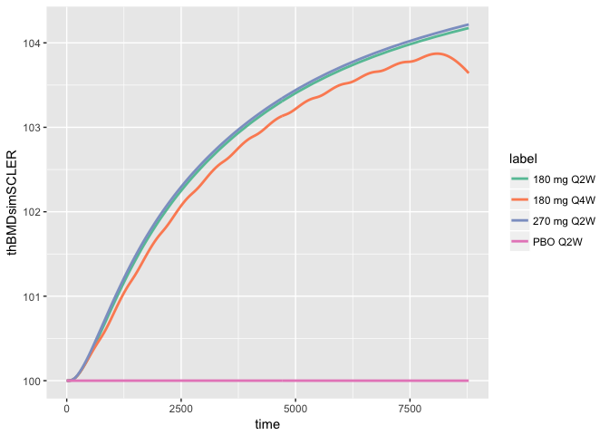

Calcium Bone Model
==================

Documentation
-------------

-   Documentation [here](vignettes/modeldoc.Rmd)

Installation
------------

``` r
remotes::install_github("metrumresearchgroup/cabone")
```

Usage
-----

``` r
library(cabone)
library(ggplot2)
```

Simulate teriparatide data
--------------------------

``` r
out <- sim_teri(dose=c(20,40), dur=9)

plot(out)
```


Simulate denosumab data
-----------------------

``` r
out <- sim_denos(dose=c(10,60,210), dur=6)

plot(out, log(DENCP) + BMDlsDENchange~time, xlab="time (months)")
```


Simulate sclerostin data
------------------------

``` r
out<-sim_scler(dose=c(70,210,350), dur=12)

plot(out, SOSTCP + lsBMDsimSCLER~time, xlab="time (hours)")
```


Simulate secondary hyperparathyroidism
======================================

Have `GFR` decline by a certain amount (`GFRdelta`) over a certail period of time (`GFRtau`).

``` r
sim_2h() %>% plot
```


Some helper functions
=====================

Convert `teriparatide` doses
----------------------------

Usually, we think of doses in micrograms. This function turns those doses into `pmol`.

``` r
amt_teri(20)
```

    . [1] 4856.962

This is a function to re-create plots from Eudy, et al.(2015), CPT:PSP; Figure 3
--------------------------------------------------------------------------------

``` r
sims <- sim_scler_data()
```

### `P1NP`

``` r
ggplot(data=sims, aes(time,P1NPsim)) + 
   geom_line() + facet_wrap(~label)
```


### `CTX`

``` r
ggplot(data=sims, aes(time,CTXsim)) + 
   geom_line() + facet_wrap(~label)
```


### Lumbar spine `BMD`

``` r
ggplot(data=sims, aes(time,lsBMDsimSCLER)) + 
   geom_line() + facet_wrap(~label)
```



### Total hip `BMD`

``` r
ggplot(data=sims, aes(time,thBMDsimSCLER)) + 
   geom_line() + facet_wrap(~label)
```


This is a function to simulate combination therapy (combination arm data from DATA study, Leder et al, 2014)
------------------------------------------------------------------------------------------------------------

(ACOP 2015 poster)
------------------

``` r
#sim_combo_arms()
```

Export the model code
---------------------

It's a little hard to see what's happening here. But basically, this grabs the model code and writes it to a file of your choosing. Use this when you want to export the model and start making changes yourself.

``` r
file <- file.path(tempdir(),"my_model.cpp")
file_location <- cabone_export(file)
```
